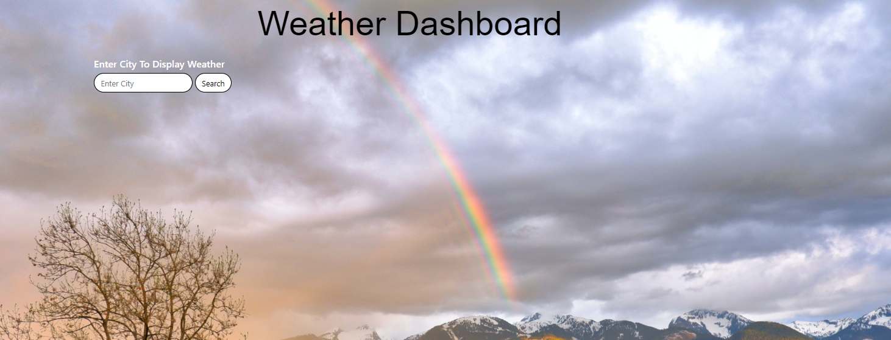
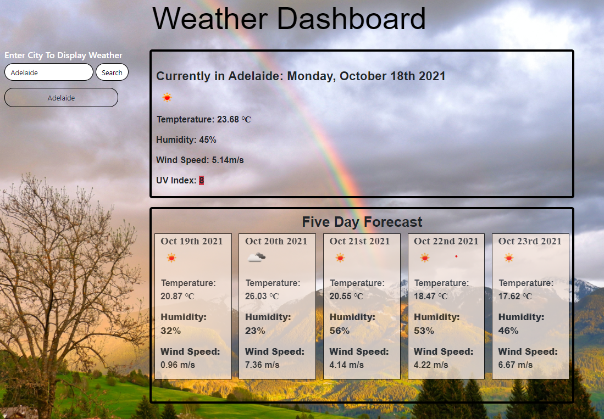
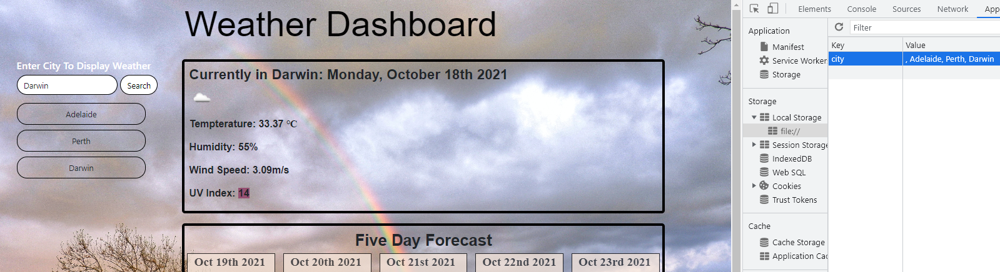

# <Weather Dashboard>

## Description

The task for this week was to create a functioning weather dashboard for a traveller so they can look up weather and plan their trip accordingly. 
Once the user had searched for a city they were to be presentend with an array of information.   The information that needed to be display included: city name, current date, an icon representing the current weather condition, the temperature, humidity, wind speed as well as a color coded UV index. 

Fundemental to the task was using the skills we had learnt about server-side API's to collect data, specifically from Open Weather One Call API. As well as applying our knowledge and skills in regards to API calls we also needed to use our background in HTML, CSS, Javascript to successfully complete the date. 

One of the biggest problems was sorting through all the data we were provided with and figuring out what was required. At times we were provided with data that needed to be converted, such as the date.

Here is a link to the deployed applicatoin: 

https://mjhwest.github.io/5-Day-Weather-Dashboard/

## Usage

The usage of this application is straight forward. 

The user is to be presented with a dashboard, with a search option so they can look up any given city. 

The user then searches for a city and will be displayed with the current weather and the 5 day forecast. 

The search result needs to be stored in local storage so if the user refreshes the applicaton, the search histories are still there. 

## Features
There are a number of features that were used to complete this project.  
 
-Bootstrap Layout  
 
-Open Weather One Call API  
 
-Font Awesome  
 
-Moment.js  
 
-JQuery  
  
  ##License 
  MIT License

Copyright (c) 2021 Michael West

